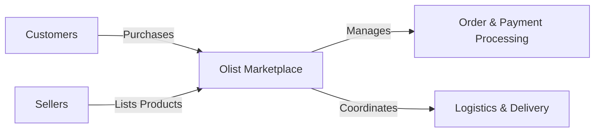

# Business Requirements Document (BRD)

> **Project:** Enterprise E-Commerce Analytics & ML Platform (Analytica 360)

| Field | Details |
| :--- | :--- |
| **Project Type** | Enterprise Data Engineering, Applied ML & Executive Analytics |
| **Domain** | Retail / E-Commerce |
| **Dataset** | Brazilian E-Commerce Public Dataset by Olist (100,000+ Records) |
| **Version** | 2.0 (Production) |
| **Status** | ✅ Production Architecture & Requirements Approved |
| **Author** | Analytica Platform Engineering Team |
| **Technologies** | MySQL 8.0, Polars (Vectorized Python ETL), FastAPI (Async), LightGBM, Next.js 16 |

---

## 📌 Executive Summary

Olist is a Brazilian e-commerce marketplace that connects customers with independent sellers through a centralized online platform. The company generates large volumes of transactional data across customers, products, sellers, payments, deliveries, and customer reviews.

Currently, the data exists in multiple operational tables, making business reporting and strategic analysis time-consuming. This project aims to design and implement a modern **Retail Data Warehouse** that consolidates these datasets into a single analytics-ready repository.

The warehouse will support executive reporting, sales analytics, customer analytics, logistics monitoring, and financial reporting through optimized SQL queries and interactive Power BI dashboards.

---

## 1. 🏢 Business Overview

### Company Background
Olist operates as a marketplace platform rather than a traditional retailer. Independent sellers list products on the platform while customers purchase products through a unified shopping experience. Olist manages order processing, payment handling, delivery coordination, and customer feedback.

The organization requires an integrated analytical platform that enables stakeholders to monitor business performance and make data-driven decisions.

### Business Model

The marketplace consists of three primary participants:
1. **Customers**
2. **Sellers**
3. **Olist Marketplace**

Olist facilitates:
- Product Listings
- Order Management
- Payment Processing
- Logistics Coordination
- Customer Reviews
- Marketplace Operations

---

## 2. ⚠️ Problem Statement

Business information is distributed across multiple transactional datasets. Because of this:

*   ❌ Business reporting requires manual effort.
*   ❌ Cross-functional analysis is difficult.
*   ❌ KPI monitoring is inconsistent.
*   ❌ Decision-making is slower than desired.
*   ❌ Executives lack a centralized reporting system.

> [!IMPORTANT]
> A centralized analytical data warehouse is required to solve these challenges and provide a single source of truth.

---

## 3. 🎯 Project Objectives

The project aims to:

1. **Centralize Business Data:** Integrate transactional datasets into a single source of truth.
2. **Enable Data-Driven Decision Making:** Provide reliable business insights through SQL analytics and Power BI dashboards.
3. **Improve Sales Visibility:** Analyze product, seller, category, and regional sales performance.
4. **Improve Operational Monitoring:** Track logistics performance, delivery efficiency, and order fulfillment.
5. **Understand Customer Behavior:** Analyze purchasing behavior, customer satisfaction, and review patterns.
6. **Deliver Executive Reporting:** Provide interactive dashboards for monitoring organizational KPIs.

---

## 4. 👥 Stakeholders

| Stakeholder | Responsibilities | Business Needs |
| :--- | :--- | :--- |
| **Executive Leadership** | Strategic planning | High-level KPIs and business trends |
| **Sales & Marketplace Team** | Seller and product management | Sales performance analysis |
| **Logistics & Operations** | Delivery management | Shipping and delivery monitoring |
| **Customer Experience Team**| Customer satisfaction | Reviews and customer behavior |
| **Finance Team** | Revenue and payments | Financial reporting and payment analysis |

---

## 5. 📈 Business KPIs

### Sales
- Total Revenue, Total Orders, Average Order Value (AOV), Monthly Sales Growth
- Revenue by Product Category, Revenue by Seller, Revenue by State

### Customer
- Total Customers, Repeat Customers, Customer Purchase Frequency
- Average Review Score, Review Score Distribution

### Seller
- Total Sellers, Revenue by Seller, Orders per Seller
- Average Seller Rating, Top Performing Sellers

### Logistics
- Average Delivery Time, Average Shipping Time
- Late Delivery Rate, On-Time Delivery Rate, Order Status Distribution

### Finance
- Payment Method Distribution, Average Payment Value
- Installment Usage, Revenue by Payment Method

---

## 6. ❓ Business Questions

| Area | Key Questions |
| :--- | :--- |
| **Executive** | What is the total business revenue? How has revenue changed over time? Which regions contribute the highest revenue? Which product categories generate the most sales? What is the average order value? |
| **Sales** | Which sellers generate the highest revenue/most orders? Which products sell the most? Which product categories are growing? Which sellers underperform? |
| **Logistics** | What is the average delivery time? What percentage of deliveries are late? Which regions experience delivery delays? Which sellers have poor delivery performance? |
| **Customer Experience** | What is the average customer rating? Which products receive poor reviews? Which sellers have the highest customer satisfaction? Do late deliveries impact customer ratings? |
| **Finance** | Which payment methods are most popular? How many installments do customers typically use? What is the average payment amount? Which payment method contributes the highest revenue? |

---

## 7. 📊 Expected Dashboards

| Dashboard | Purpose | Visualizations |
| :--- | :--- | :--- |
| **Executive** | High-level overview of organizational performance. | KPI Cards, Revenue/Orders Trend, Revenue by State/Category, Customer Growth |
| **Sales** | Analyze marketplace sales performance. | Seller Ranking, Product/Category Performance, Monthly Revenue, Top Products |
| **Customer** | Analyze customer behavior and satisfaction. | Customer Distribution, Review Score Distribution, Customer Growth, Ratings by Seller/Category |
| **Logistics** | Monitor delivery efficiency. | Delivery Time Trend, Late Delivery Analysis, Delivery Time by State/Seller, Order Status Distribution |
| **Payment** | Analyze financial transactions. | Payment Method Distribution, Revenue by Payment Method, Installment Analysis, Average Payment Value |

---

## 8. 🔭 Project Scope

### ✅ In Scope
- Retail Data Warehouse Design & Dimensional Modeling (Star Schema)
- Python ETL Pipeline & PostgreSQL Data Warehouse
- SQL Analytics & Power BI Dashboards
- Business Documentation

### ❌ Out of Scope
- Machine Learning & Demand Forecasting
- Fraud Detection & Recommendation Systems
- Real-Time Streaming & Inventory Optimization

---

## 9. 🧠 Assumptions

- Source datasets are historically complete.
- Customer identifiers remain unique.
- Payment records accurately represent completed transactions.
- Review scores represent customer satisfaction.
- Delivery timestamps are reliable.

---

## 10. 🏆 Success Criteria

The project will be considered successful if it:
- Builds a centralized analytical data warehouse.
- Integrates all transactional datasets through an automated ETL pipeline.
- Implements an optimized Star Schema.
- Delivers interactive Power BI dashboards.
- Enables business users to monitor KPIs without writing SQL.
- Supports scalable business analytics for future expansion.

---

## 11. 🛠 Planned Technology Stack

| Layer | Technology |
| :--- | :--- |
| **Programming Language** | Python |
| **Data Processing** | Polars |
| **Database** | PostgreSQL |
| **SQL** | PostgreSQL SQL |
| **Data Warehouse** | Star Schema |
| **Business Intelligence** | Power BI |
| **Version Control** | Git & GitHub |
| **Documentation** | Markdown |
| **IDE** | Visual Studio Code |

---

## 12. 📦 Project Deliverables

- [ ] Business Requirements Document
- [ ] Data Dictionary
- [ ] Entity Relationship Diagram (ERD)
- [ ] Star Schema Design
- [ ] PostgreSQL Data Warehouse
- [ ] Python ETL Pipeline
- [ ] SQL Analytics Scripts
- [ ] Power BI Dashboards
- [ ] Project Documentation
- [ ] GitHub Repository