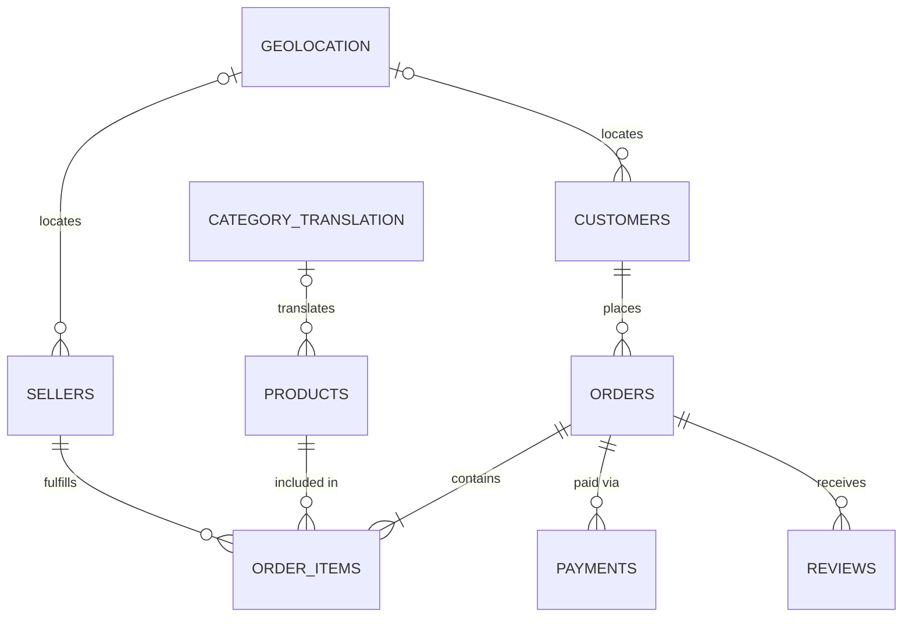

# Data Dictionary

> **Project:** Enterprise E-Commerce Analytics & ML Platform (Analytica 360)  
> **Dataset:** Brazilian E-Commerce Public Dataset by Olist  
> **Version:** 2.0 (Production)  

---

## 📄 Document Overview

This document provides a complete description of all source datasets used in the Retail Data Warehouse project. It serves as the primary reference for understanding the business meaning, structure, relationships, and warehouse role of every source table before ETL development and dimensional modeling.

**Objectives:**
- Understand the business purpose of each dataset
- Document table structures
- Identify primary and foreign keys
- Define the grain of each dataset
- Record business usage
- Identify future warehouse components
- Document expected data quality validations

---

## 🗂 Table Classification

| Source Table | Table Type | Warehouse Role |
| :--- | :--- | :--- |
| **Customers** | Dimension Source | DimCustomer |
| **Orders** | Transaction Source | Sales Event Source |
| **Order Items** | Transaction Source | FactSales |
| **Products** | Dimension Source | DimProduct |
| **Sellers** | Dimension Source | DimSeller |
| **Payments** | Transaction Source | Payment Enrichment |
| **Reviews** | Analytical Source | Customer Satisfaction Enrichment |
| **Geolocation** | Reference Table | Geographic Enrichment |
| **Category Translation** | Lookup Table | Product Category Enrichment |

---

## 🏗 Overall Source System Architecture (ERD)

---

## 🗃 Dataset Definitions

### 1. Customers (`olist_customers_dataset`)
> **Business Purpose:** Stores customer identification and geographic information used for customer analytics and regional reporting.
> **Warehouse Candidate:** Dimension Table — `DimCustomer`

| Property | Details |
| :--- | :--- |
| **Grain** | One row represents one customer record associated with an order account. |
| **Row Count** | 99,441 |
| **Primary Key** | `customer_id` |
| **Foreign Keys** | `customer_id` → `orders.customer_id` |
| **Expected DQ Checks** | Duplicate `customer_id`, Duplicate `customer_unique_id`, Missing city/state, Invalid ZIP codes |

**Columns:**
| Column | Description |
| :--- | :--- |
| `customer_id` | Unique identifier for a customer record |
| `customer_unique_id` | Persistent customer identifier across multiple purchases |
| `customer_zip_code_prefix` | Customer ZIP code prefix |
| `customer_city` | Customer city |
| `customer_state` | Customer state |

---

### 2. Orders (`olist_orders_dataset`)
> **Business Purpose:** Stores order-level transactional information and tracks the complete lifecycle of every customer order from purchase through delivery.
> **Warehouse Candidate:** Core Transaction Source for `FactSales`

| Property | Details |
| :--- | :--- |
| **Grain** | One row represents one customer order. |
| **Row Count** | 99,441 |
| **Primary Key** | `order_id` |
| **Foreign Keys** | `customer_id` → `customers.customer_id` |
| **Referenced By** | `order_items.order_id`, `order_payments.order_id`, `order_reviews.order_id` |
| **Derived Metrics** | Delivery Time, Shipping Time, Approval Time, Processing Time, Late Delivery Indicator |

**Columns:**
| Column | Description |
| :--- | :--- |
| `order_id` | Unique order identifier |
| `customer_id` | Customer placing the order |
| `order_status` | Current order status |
| `order_purchase_timestamp` | Purchase timestamp |
| `order_approved_at` | Order approval timestamp |
| `order_delivered_carrier_date` | Carrier pickup timestamp |
| `order_delivered_customer_date` | Customer delivery timestamp |
| `order_estimated_delivery_date`| Estimated delivery date |

---

### 3. Order Items (`olist_order_items_dataset`)
> **Business Purpose:** Stores individual products sold within customer orders, including pricing and freight information.
> **Warehouse Candidate:** Fact Table — `FactSales`

| Property | Details |
| :--- | :--- |
| **Grain** | One row represents one product purchased within one order. |
| **Row Count** | 112,650 |
| **Primary Key** | Composite: `order_id`, `order_item_id` |
| **Foreign Keys** | `order_id` → `orders.order_id`, `product_id` → `products.product_id`, `seller_id` → `sellers.seller_id` |
| **Measures** | Price, Freight Value |

**Columns:**
| Column | Description |
| :--- | :--- |
| `order_id` | Order identifier |
| `order_item_id` | Product line number |
| `product_id` | Purchased product |
| `seller_id` | Seller fulfilling the order |
| `shipping_limit_date` | Seller shipping deadline |
| `price` | Product selling price |
| `freight_value` | Shipping cost |

---

### 4. Products (`olist_products_dataset`)
> **Business Purpose:** Stores descriptive product information used for product analytics and category reporting.
> **Warehouse Candidate:** Dimension Table — `DimProduct`

| Property | Details |
| :--- | :--- |
| **Grain** | One row represents one unique product. |
| **Row Count** | 32,951 |
| **Primary Key** | `product_id` |
| **Referenced By** | `order_items.product_id` |

**Columns:**
| Column | Description |
| :--- | :--- |
| `product_id` | Product identifier |
| `product_category_name` | Product category |
| `product_name_lenght` | Product name length |
| `product_description_lenght` | Product description length |
| `product_photos_qty` | Number of product photos |
| `product_weight_g` | Product weight |
| `product_length_cm` | Product length |
| `product_height_cm` | Product height |
| `product_width_cm` | Product width |

---

### 5. Sellers (`olist_sellers_dataset`)
> **Business Purpose:** Stores seller information and geographic location for marketplace analysis.
> **Warehouse Candidate:** Dimension Table — `DimSeller`

| Property | Details |
| :--- | :--- |
| **Grain** | One row represents one unique seller. |
| **Row Count** | 3,095 |
| **Primary Key** | `seller_id` |
| **Referenced By** | `order_items.seller_id` |

**Columns:**
| Column | Description |
| :--- | :--- |
| `seller_id` | Seller identifier |
| `seller_zip_code_prefix` | Seller ZIP code prefix |
| `seller_city` | Seller city |
| `seller_state` | Seller state |

---

### 6. Payments (`olist_order_payments_dataset`)
> **Business Purpose:** Stores payment information for customer orders.
> **Warehouse Candidate:** Payment Enrichment (Supporting transaction source)

| Property | Details |
| :--- | :--- |
| **Grain** | One row represents one payment transaction for an order. |
| **Row Count** | 103,886 |
| **Primary Key** | Composite: `order_id`, `payment_sequential` |
| **Foreign Keys** | `order_id` → `orders.order_id` |

**Columns:**
| Column | Description |
| :--- | :--- |
| `order_id` | Associated order |
| `payment_sequential` | Payment sequence |
| `payment_type` | Payment method |
| `payment_installments` | Number of installments |
| `payment_value` | Payment amount |

---

### 7. Reviews (`olist_order_reviews_dataset`)
> **Business Purpose:** Stores customer feedback for completed orders.
> **Warehouse Candidate:** Customer Satisfaction Enrichment

| Property | Details |
| :--- | :--- |
| **Grain** | One row represents one customer review associated with an order. |
| **Row Count** | 99,224 |
| **Primary Key** | `review_id` |
| **Foreign Keys** | `order_id` → `orders.order_id` |

**Columns:**
| Column | Description |
| :--- | :--- |
| `review_id` | Review identifier |
| `order_id` | Associated order |
| `review_score` | Customer rating |
| `review_comment_title` | Review title |
| `review_comment_message` | Review message |
| `review_creation_date` | Review creation date |
| `review_answer_timestamp`| Review submission timestamp |

---

### 8. Geolocation (`olist_geolocation_dataset`)
> **Business Purpose:** Stores geographic reference data for Brazilian ZIP code prefixes.
> **Warehouse Candidate:** Geographic Enrichment

| Property | Details |
| :--- | :--- |
| **Grain** | One row represents one geographic coordinate associated with a ZIP code prefix. |
| **Row Count** | 1,000,163 |
| **Primary Key** | None |
| **Referenced By** | `customers.customer_zip_code_prefix`, `sellers.seller_zip_code_prefix` |

**Columns:**
| Column | Description |
| :--- | :--- |
| `geolocation_zip_code_prefix`| ZIP code prefix |
| `geolocation_lat` | Latitude |
| `geolocation_lng` | Longitude |
| `geolocation_city` | City |
| `geolocation_state` | State |

---

### 9. Category Translation (`product_category_name_translation`)
> **Business Purpose:** Stores English translations of Portuguese product category names.
> **Warehouse Candidate:** Product Category Enrichment

| Property | Details |
| :--- | :--- |
| **Grain** | One row represents one product category translation. |
| **Row Count** | 71 |
| **Primary Key** | `product_category_name` |
| **Referenced By** | `products.product_category_name` |

**Columns:**
| Column | Description |
| :--- | :--- |
| `product_category_name` | Portuguese category |
| `product_category_name_english`| English category |

---

## 🎯 Final Warehouse Mapping Summary

| Source Table | Warehouse Component | Type |
| :--- | :--- | :--- |
| **Customers** | `DimCustomer` | Dimension |
| **Products** | `DimProduct` | Dimension |
| **Sellers** | `DimSeller` | Dimension |
| **Orders** | Sales Event Source | Fact Base |
| **Order Items** | `FactSales` | Fact |
| **Payments** | Payment Enrichment | Fact Add-on |
| **Reviews** | Customer Satisfaction | Fact Add-on |
| **Geolocation** | Geography Enrichment | Reference |
| **Category Translation**| Category Enrichment | Lookup |