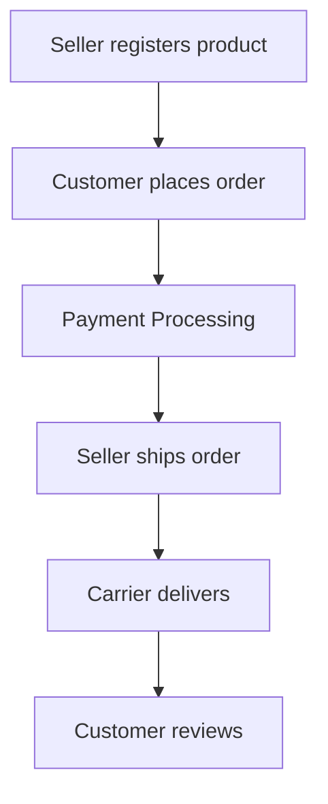
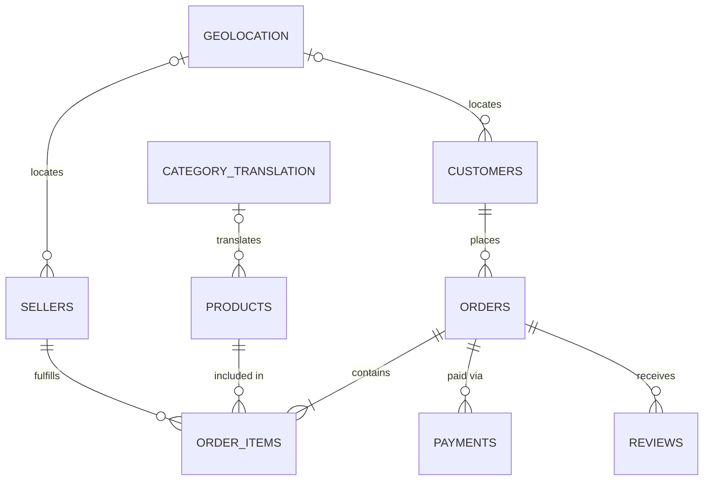
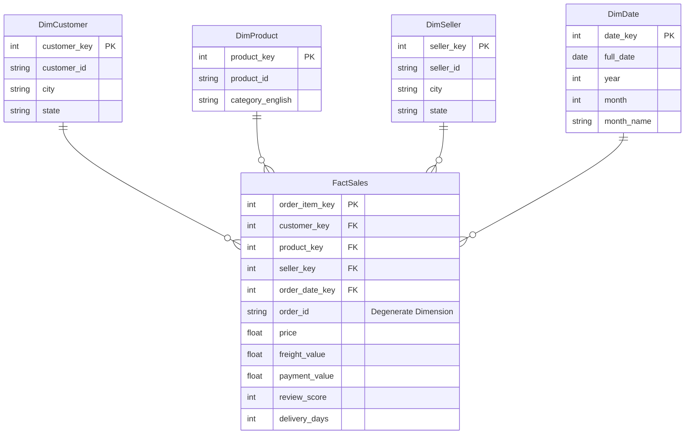
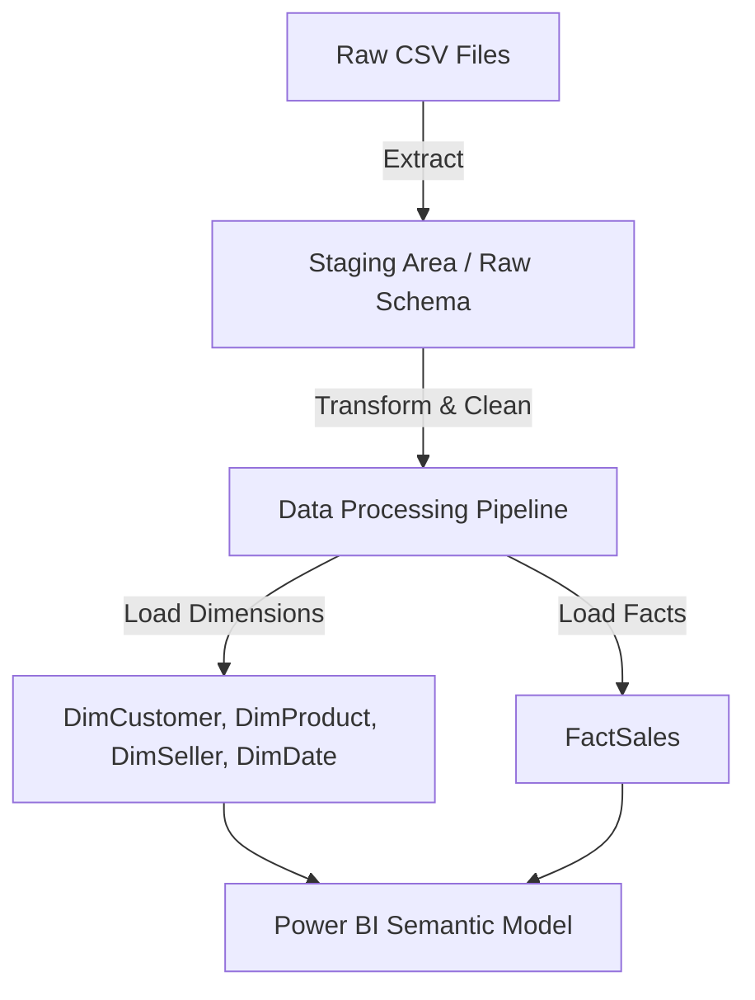

# Data Warehouse Dimensional Modeling Strategy

> **Project:** Enterprise E-Commerce Analytics & ML Platform (Analytica 360)  
> **Methodology:** Kimball Dimensional Modeling & Star Schema Design  
> **Version:** 2.0 (Production)  

## 🎯 Objective
Transform operational (OLTP) source systems into an optimized dimensional model (`brazilian_ecommerce_dw`) suitable for high-speed analytics, machine learning feature stores, and sub-2ms FastAPI endpoints.

---

## Part 1 – Business Process Analysis

### Goal
Understand what business event the warehouse models.

### Business Lifecycle & Event Timeline
The core business process revolves around e-commerce retail transactions. The lifecycle of a transaction involves multiple steps from product listing to customer review.

---

## Part 2 – Entity Relationship Analysis

Every relationship in the OLTP database is analyzed to understand the operational model.

| Parent | Child | Join Key | Cardinality | Optional/Mandatory | Business Meaning |
| :--- | :--- | :--- | :--- | :--- | :--- |
| **Customers** | Orders | `customer_id` | 1:N | Mandatory | A customer can place multiple orders, but an order belongs to one customer. |
| **Orders** | Order Items | `order_id` | 1:N | Mandatory | An order can contain multiple items/products. |
| **Products** | Order Items | `product_id` | 1:N | Mandatory | A product can be sold in multiple orders. |
| **Sellers** | Order Items | `seller_id` | 1:N | Mandatory | A seller can fulfill multiple order items. |
| **Orders** | Payments | `order_id` | 1:N | Mandatory | An order can have multiple payment sequences/methods. |
| **Orders** | Reviews | `order_id` | 1:N | Optional | An order can receive customer reviews (not guaranteed). |

---

## Part 3 – Primary & Foreign Key Analysis

A detailed breakdown of keys used in the source system and why they exist.

| Table | Primary Key | Foreign Key(s) | Reason |
| :--- | :--- | :--- | :--- |
| **Customers** | `customer_id` | — | Uniquely identifies a customer account tied to a specific order. |
| **Orders** | `order_id` | `customer_id` | Uniquely identifies a purchase event. |
| **Order Items** | `order_id` + `order_item_id` | `product_id`, `seller_id`, `order_id` | Identifies individual items within a specific order. |
| **Products** | `product_id` | — | Uniquely identifies a product catalog entry. |
| **Sellers** | `seller_id` | — | Uniquely identifies an independent seller. |
| **Payments** | `order_id` + `payment_sequential` | `order_id` | Tracks individual payment parts (e.g., split payments). |
| **Reviews** | `review_id` | `order_id` | Uniquely identifies a customer feedback entry. |

---

## Part 4 – Table Classification

Categorizing every operational table into its future data warehouse role.

| Table | Type |
| :--- | :--- |
| **Customers** | Dimension Source |
| **Products** | Dimension Source |
| **Sellers** | Dimension Source |
| **Orders** | Transaction Source |
| **Order Items** | Transaction Source |
| **Payments** | Supporting Transaction |
| **Reviews** | Supporting Analytical |
| **Geolocation** | Reference |
| **Translation** | Lookup |

> [!NOTE]
> This classification dictates whether a table becomes a **Dimension** (descriptive context) or part of a **Fact** (measurable events).

---

## Part 5 – Fact Identification

> **What is the measurable business event?**  
> Answer: **Product sold.**

Therefore, the core fact table is **`FactSales`**.

**Candidate Measures:**
* Sales Amount (`price`)
* Freight Cost (`freight_value`)
* Payment Value (from Payments table)
* Delivery Days (derived from Orders table)
* Review Score (from Reviews table)

**Why `Order Items` instead of `Orders`?**  
`Orders` only tells us a transaction happened. `Order Items` gives us the exact product, price, seller, and freight cost. To enable robust product and seller analytics, the fact table must be built at the item level.

---

## Part 6 – Grain Definition

The grain defines what a single row in the fact table represents.

> **Atomic Grain:** One row represents **one product sold within one customer order**.

* **Lowest level of detail:** This allows slicing by product, seller, customer, and date without losing any precision.
* **Why it was chosen:** Building the fact table at the order-item level provides maximum flexibility. We can always roll up to the order level (SUM), but we cannot drill down if we start at the order level.

---

## Part 7 – Dimension Identification

Identifying the descriptive context (Dimensions) surrounding the fact.

| Dimension | Purpose | Source Table | Key Attributes |
| :--- | :--- | :--- | :--- |
| **`DimCustomer`** | Analyze who bought the products | Customers, Geolocation | Customer ID, City, State, ZIP, Region |
| **`DimProduct`** | Analyze what was sold | Products, Translation | Product ID, Category (English), Weight, Dimensions |
| **`DimSeller`** | Analyze who fulfilled the order | Sellers, Geolocation | Seller ID, City, State, ZIP |
| **`DimDate`** | Analyze when events happened | Generated | Date, Year, Quarter, Month, Day, Day of Week |

---

## Part 8 – Measure Identification

| Measure | Source | Type | Description |
| :--- | :--- | :--- | :--- |
| **Price** | Order Items | Additive | Revenue from the product itself |
| **Freight** | Order Items | Additive | Cost of shipping |
| **Payment Value** | Payments | Additive | Total amount paid by customer |
| **Review Score** | Reviews | Non-additive | Average rating given by customer (cannot be summed) |
| **Delivery Days** | Orders (Derived) | Semi-additive | Time taken to deliver |

---

## Part 9 – Hierarchy Analysis

Identified drill-down paths for OLAP analysis in Power BI:

**Date Hierarchy:**  
`Year` ➡️ `Quarter` ➡️ `Month` ➡️ `Day`

**Location Hierarchy (Customer & Seller):**  
`State` ➡️ `City` ➡️ `ZIP`

**Product Hierarchy:**  
`Category` ➡️ `Product ID`

---

## Part 10 – Slowly Changing Dimensions (SCD)

* **Customer Address Changes:** Customers may move, but in this snapshot dataset, we don't have historical address changes tracking. SCD Type 1 (Overwrite) is sufficient.
* **Seller Location Changes:** Rare. SCD Type 1.
* **Product Category Changes:** Possible, but practically static in this dataset. SCD Type 1.

> [!IMPORTANT]
> **Design Choice:** We will implement **SCD Type 1** for all dimensions. While SCD Type 2 is standard for maintaining history, it adds unnecessary complexity for a static, one-time historical public dataset.

---

## Part 11 – Surrogate Key Strategy

The warehouse tables will use **Surrogate Keys** (integer-based auto-incrementing IDs).

* `customer_key`
* `product_key`
* `seller_key`
* `date_key` (YYYYMMDD)

**Why Surrogate Keys?**
1. **Faster Joins:** Integer joins are significantly faster than string/UUID joins in PostgreSQL and Power BI.
2. **Stable Identifiers:** Protects the warehouse from changes or reuse of keys in the source system.
3. **Decoupling:** Isolates the warehouse from source OLTP architecture.

---

## Part 12 – Degenerate Dimensions

`order_id` is a transaction identifier with no descriptive attributes. Instead of creating a `DimOrder` table that would be exactly the same size as the fact table, `order_id` will be kept directly in `FactSales` as a **Degenerate Dimension**. This allows tracking and auditing back to source systems without performance penalties.

---

## Part 13 – Fact-Dimension Matrix

*(See `Fact_Dimension_Matrix.md` for full details)*  
The matrix confirms that `FactSales` successfully conforms to Customer, Product, Seller, and Date dimensions.

---

## Part 14 – Source-to-Warehouse Mapping

*(See `Source_to_Warehouse_Mapping.md` for full details)*  
Detailed field-level mapping outlining exactly how source OLTP tables map to our star schema.

---

## Part 15 – ERD (Operational Model)

This is the state of the raw source data before transformation.

---

## Part 16 – Star Schema Design

This is the target state for our Data Warehouse.

---

## Part 17 – Warehouse Architecture Decisions

* **Why Star Schema over Snowflake?**  
  A Star Schema is optimized for read-heavy BI workloads. Snowflaking (e.g., breaking out `DimLocation`) would increase join complexity and slow down Power BI without saving meaningful storage.
* **Why Denormalization?**  
  Storage is cheap; compute is expensive. Denormalizing `Translation` into `DimProduct` and `Geolocation` into `DimCustomer` / `DimSeller` reduces joins from 9 tables to just 1 Fact and 4 Dimensions.
* **Why One Fact Table?**  
  All critical business processes (payments, reviews, shipping) revolve around the central act of an order item being sold. Consolidating them into one fact table simplifies BI reporting.

---

## Part 18 – Final Warehouse Blueprint

| Warehouse Object | Source |
| :--- | :--- |
| **`FactSales`** | `order_items` + `orders` + `payments` + `reviews` |
| **`DimCustomer`** | `customers` + `geolocation` |
| **`DimProduct`** | `products` + `product_category_name_translation` |
| **`DimSeller`** | `sellers` + `geolocation` |
| **`DimDate`** | Generated via Python/SQL |

### Data Flow Architecture

