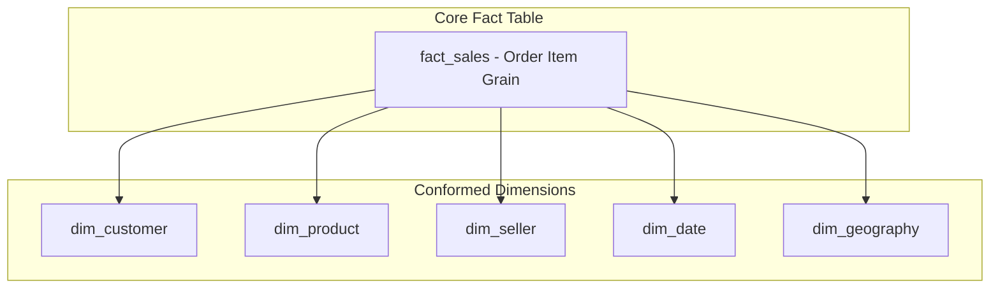

# Fact-Dimension Bus Matrix (Data Warehouse Bus Architecture)

> **Project:** Enterprise E-Commerce Analytics & ML Platform (Analytica 360)  
> **Architecture Standard:** Kimball Dimensional Modeling Methodology  

The **Fact-Dimension Bus Matrix** (Data Warehouse Bus Matrix) is the foundational architectural blueprint for **Analytica**. It maps core enterprise business processes (Fact events) to the standardized descriptive contexts (Conformed Dimensions) shared across the enterprise data warehouse.

---

## 📊 Enterprise Bus Matrix

| Business Process (Fact Event) | DimCustomer | DimProduct | DimSeller | DimDate | DimGeography | Degenerate Dim (Order ID) | Granularity |
| :--- | :---: | :---: | :---: | :---: | :---: | :---: | :--- |
| **Product Sales (Order Items)** | ✅ | ✅ | ✅ | ✅ | ✅ | ✅ | Individual Order Item |
| **Order Payments** | ✅ | ❌ | ❌ | ✅ | ✅ | ✅ | Payment Sequential |
| **Customer Reviews** | ✅ | ✅ | ✅ | ✅ | ✅ | ✅ | Review ID / Order |
| **Logistics & Delivery** | ✅ | ❌ | ✅ | ✅ | ✅ | ✅ | Fulfillment Event |

---

## ⚡ Consolidated Star Schema (`fact_sales`)

In **Analytica**, these business processes are consolidated into a high-performance **`fact_sales`** star schema at the grain of *one order item*:

| Consolidated Fact | DimCustomer | DimProduct | DimSeller | DimDate | DimGeography | Primary Metrics |
| :--- | :---: | :---: | :---: | :---: | :---: | :--- |
| **`fact_sales`** | ✅ | ✅ | ✅ | ✅ | ✅ | `price`, `freight_value`, `payment_value`, `review_score`, `delivery_days` |

---

## 💡 Key Architectural Benefits

1. **Conformed Dimensions**: Slicing by `DimDate[Year]` or `DimCustomer[state]` dynamically aggregates sales, freight costs, payment totals, and review metrics seamlessly without ambiguous join paths.
2. **Sub-2ms Query Performance**: Indexed surrogate keys (`customer_key`, `product_key`, `seller_key`, `order_date_key`) accelerate analytical queries across FastAPI endpoints.
3. **Seamless ML Integration**: Machine learning models (RFM K-Means & LightGBM forecasting) ingest clean, standardized features directly from conformed dimensional aggregates.

