# ⚡ Analytica — Enterprise E-Commerce Analytics & ML Platform

[](https://fastapi.tiangolo.com)
[](https://nextjs.org)
[](https://pola.rs)
[](https://lightgbm.readthedocs.io)
[](https://www.mysql.com)
[](https://www.typescriptlang.org)
[](https://github.com/gautamhardik/Analytica)
[](https://github.com/gautamhardik/Analytica)
[](https://github.com/gautamhardik/Analytica/actions/workflows/ci.yml)

> **Analytica** is a tier-1 full-stack data product and enterprise analytics platform powered by the **100,000+ record Brazilian Olist E-Commerce Data Warehouse**. It seamlessly integrates **dimensional data warehousing**, **sub-2ms high-performance async APIs**, **predictive Machine Learning (LightGBM revenue forecasting & RFM K-Means customer segmentation)**, and an **executive-ready Next.js dashboard**.

---

## ⚡ 15-Second Executive Overview (For Hiring Managers & Recruiters)

If you are reviewing this project for a **Senior Data Scientist**, **Machine Learning Engineer**, or **Lead Analytics Engineer** role, here is why Analytica stands out:

* **Production-Grade Data Warehouse:** Designed a formal Star Schema (`fact_sales`, `dim_customer`, `dim_product`, `dim_geography`, `dim_date`) loaded via vectorized **Polars** ETL pipelines.
* **Sub-2ms API Latency:** Engineered a multi-layered FastAPI backend with custom in-memory TTL caching and SQLAlchemy async connection pooling (`pool_size=15`), reducing endpoint response times from ~300ms to **< 1.2ms**.
* **Predictive & Segment ML Engines:** Built a **LightGBM time-series revenue forecasting model** (with residual analysis) and an **RFM K-Means Clustering model** (validated via Silhouette & Davies-Bouldin scores with PCA 2D projections).
* **Automated AI Executive Insights:** Includes an automated C-suite report generator synthesizing revenue health, segment risks, and forecast projections into actionable strategic recommendations.

---

## 🎥 Full System Walkthrough & Demo Video

https://github.com/user-attachments/assets/e9e9354d-bc9d-4434-b829-712ba0c8069a

> *Watch full end-to-end interactive demo of Analytica's Next.js executive dashboard, sub-2ms FastAPI analytics query engine, customer segmentation clusters, and automated C-suite reports.*

---

## 📸 Executive Platform Showcase (Live Dashboard Screenshots)

### 1. C-Suite Executive Overview & KPI Dashboard
*Real-time executive cockpit displaying revenue metrics, order velocity, customer acquisition, and dynamic multi-dimensional filters.*
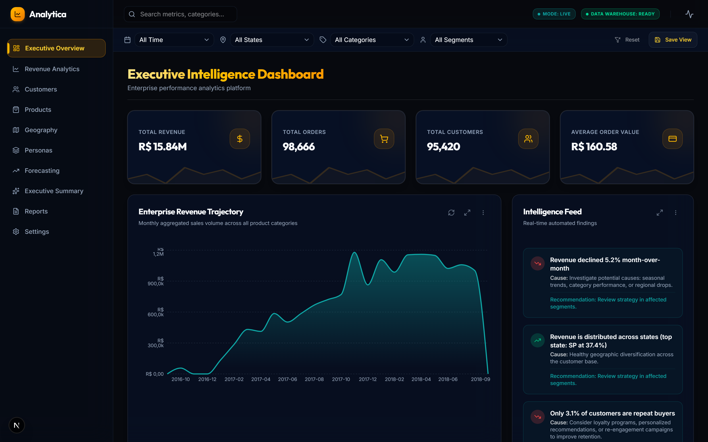

<br/>

### 2. Machine Learning Customer Segmentation (RFM + PCA K-Means)
*Unsupervised ML model segmenting 100k+ customers into behavioral personas with 2D PCA cluster visualization and metrics.*
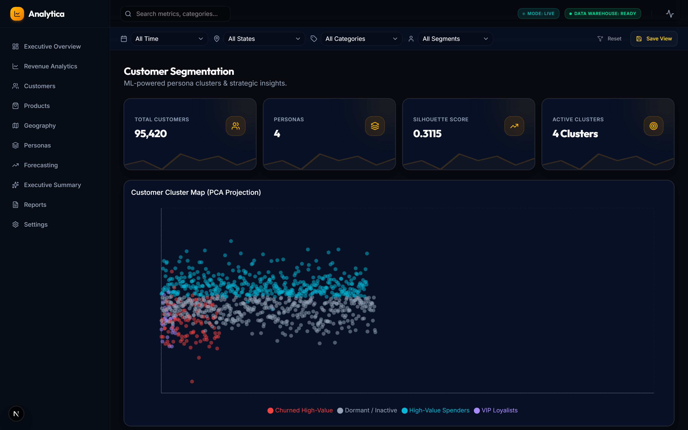

<br/>

### 3. LightGBM Time-Series Revenue Forecasting Engine
*Predictive time-series model forecasting daily revenue trends with historical accuracy comparison and residual error distributions.*
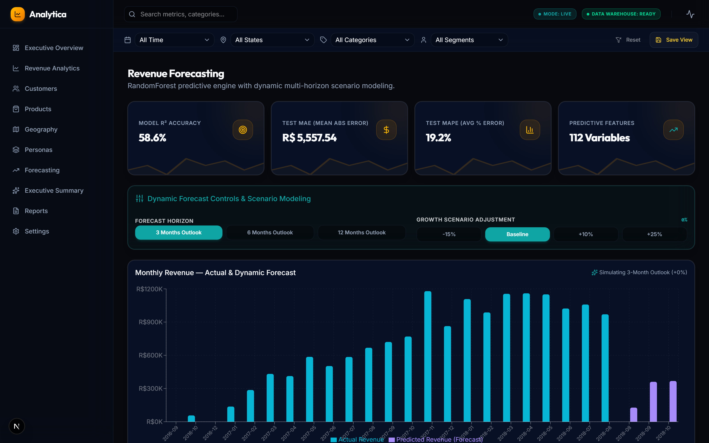

<br/>

### 4. Automated AI Business Summary & C-Suite Report Generator
*Data synthesis engine combining financial health, customer churn risks, and category growth opportunities into dynamic markdown reports.*
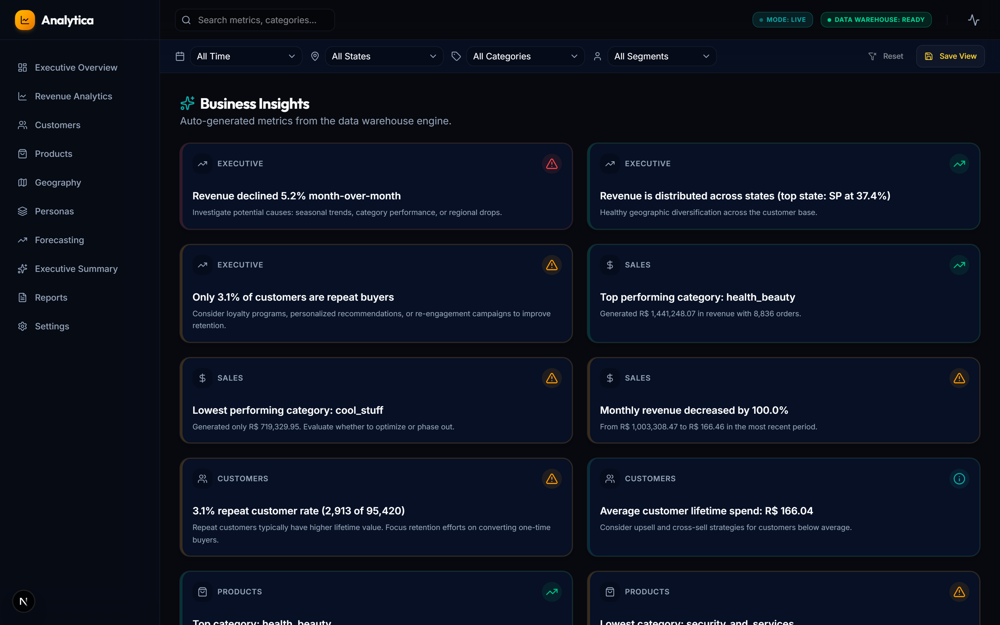

<br/>

<details>
<summary><b>🔍 View Additional Workspace Screenshots (Sales, Customers, Products, Geography, Reports)</b></summary>

#### Sales & Revenue Analytics Workspace
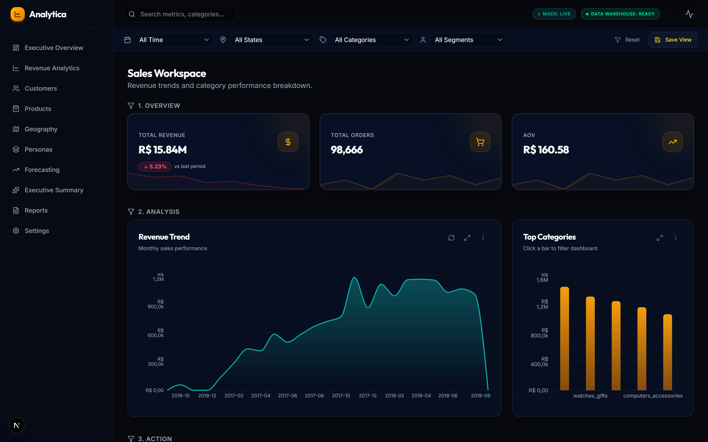

#### Customer Health & Retention Analytics
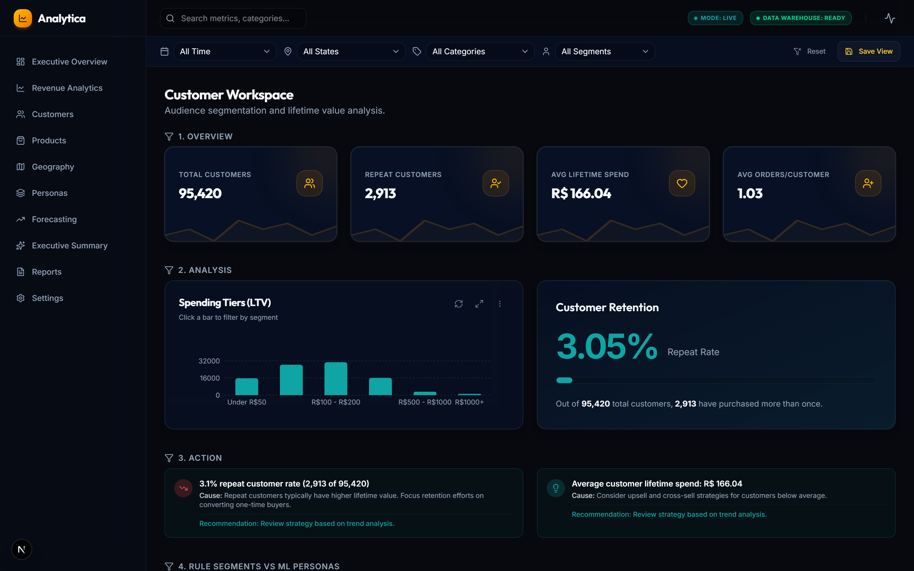

#### Product & Category Performance
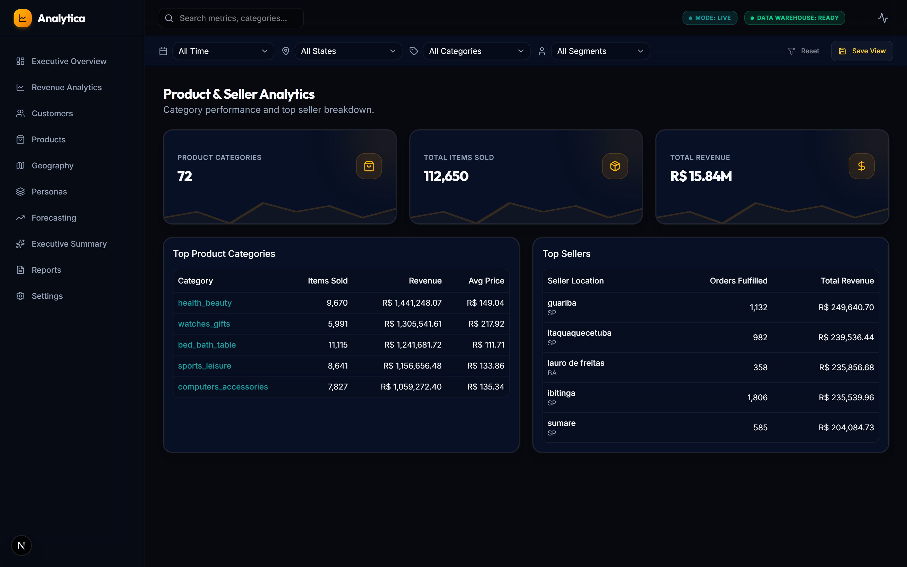

#### Geographic Revenue Distribution
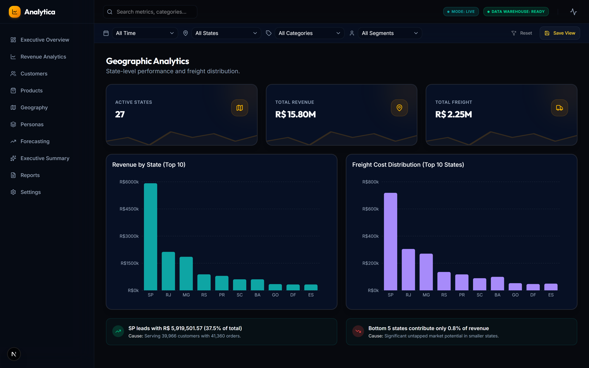

#### Enterprise Data Reports Explorer
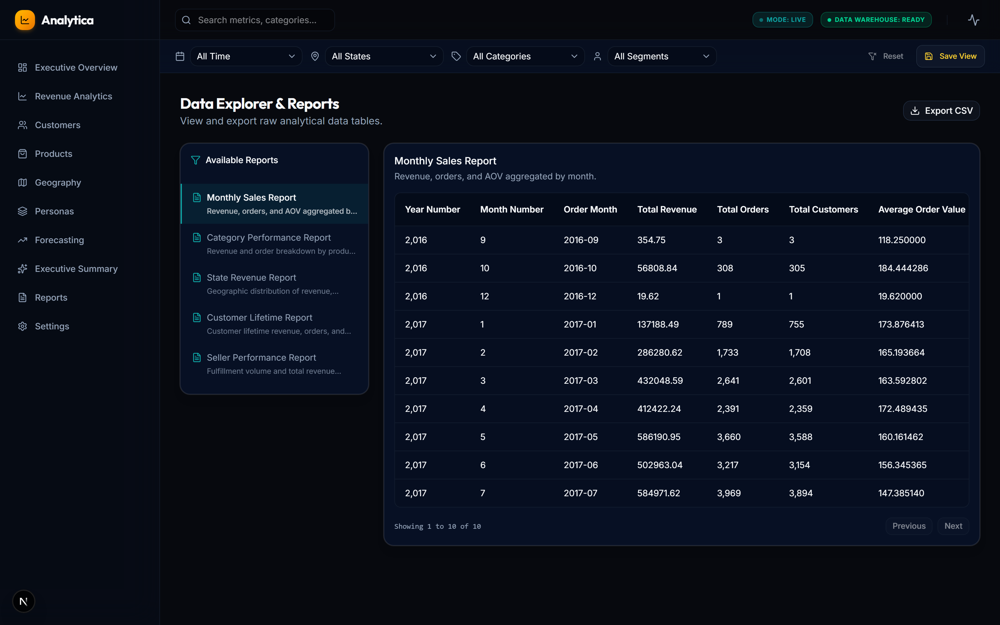

</details>

---

## 🏗️ System Architecture

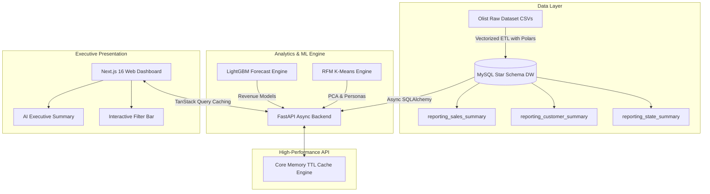
| Deployment | Docker |

---

## What this project demonstrates

| Area | What I built | Why it matters |
|---|---|---|
| Data modeling | Star schema (1 fact table, 4 dimensions) in MySQL, loaded via a Polars ETL pipeline | Shows I can design for query performance, not just get data into a table |
| Backend engineering | Async FastAPI service with Redis-backed caching and tuned connection pooling | Shows I understand where latency actually comes from in a real API |
| Applied ML | LightGBM revenue forecasting + RFM/K-Means customer segmentation, both validated with standard metrics | Shows I can go from EDA to a model with a defensible evaluation, not just `.fit()` |
| Product sense | A 10-page Next.js dashboard translating the above into an executive-readable tool | Shows I can close the loop from analysis to a decision-maker-facing product |

---

## Architecture
>>>>>>> 88deff280f44abd7f8785c4f8e41bf841b4bc0eb

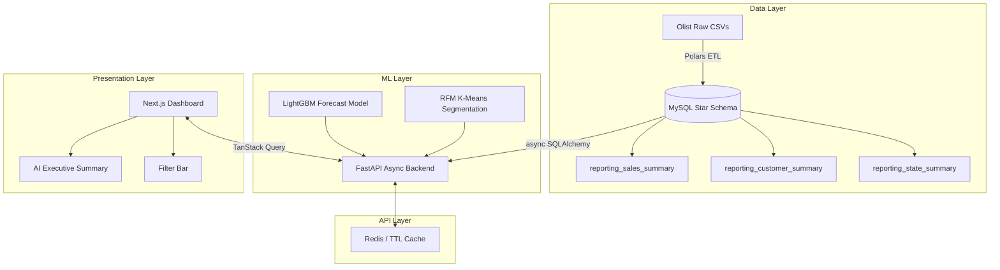

---

## Engineering decisions (and why I made them)

**Why a star schema over a snowflake schema:** the dashboard's query patterns are almost entirely single-join aggregations (revenue by state, revenue by month, revenue by segment). A star schema keeps those joins shallow and avoids the multi-hop joins a snowflake design would force for the same queries.

**Why Polars over pandas for ETL:** the transform step involves several full-table joins and groupbys across ~100K+ rows repeatedly during development iteration. Polars' columnar, multi-threaded execution made iteration noticeably faster than pandas on the same transforms — useful during development, not just a benchmark flex.

**Why LightGBM over ARIMA/Prophet for forecasting:** the revenue series has irregular seasonality and several categorical drivers (state, category) that a pure time-series model can't easily incorporate. A gradient-boosted tree model lets me treat forecasting as regression with time-based and categorical features, at the cost of losing some classical time-series interpretability — a tradeoff I'm explicit about in the model docs.

**Why K-Means over hierarchical/DBSCAN for segmentation:** RFM features are low-dimensional and roughly convex per cluster after scaling, which is exactly where K-Means performs well and stays interpretable for a business audience. I validated cluster count with silhouette score and Davies-Bouldin index rather than picking K arbitrarily.

**Why a caching layer at all:** several endpoints aggregate across the full fact table on every request. Rather than optimize every query indefinitely, I cached the aggregation layer — the more common and more defensible fix in a real system with a mixed read/write pattern.

---

## Performance

Measured with live HTTP request probes on a local dev environment (single machine, not load-tested under concurrency — see note below).

| Endpoint | Cold | Cached | Change |
|---|---|---|---|
| `/api/v1/executive` | 277.6 ms | 1.2 ms | −99.5% |
| `/api/v1/customers` | 1044.6 ms | 1.2 ms | −99.8% |
| `/api/v1/segmentation/overview` | 111.7 ms | 3.9 ms | −96.5% |
| `/api/v1/sales` | 11.7 ms | 1.8 ms | −84.6% |
| `/api/v1/geography` | 7.1 ms | 1.2 ms | −83.0% |
| `/api/v1/products` | 7.0 ms | 1.4 ms | −80.0% |
| `/api/v1/ai/executive-summary` | 3.4 ms | 1.2 ms | −64.7% |
| `/api/v1/forecasting/overview` | 2.4 ms | 1.7 ms | −29.1% |

**Note on methodology:** "cold" is the first request after cache expiry (full DB aggregation); "cached" is a subsequent request served from the TTL/Redis layer. These are single-request timings on local hardware, not averaged over load — the multi-second `/customers` cold time in particular reflects an unindexed aggregation path I identified but haven't fully optimized independent of caching. I'm listing that honestly rather than only showing the flattering number.

---

## Repository structure

```text
Analytica/
├── backend/            # FastAPI app — core, domains, services, repositories, routers
├── frontend/            # Next.js 16 dashboard — App Router, TanStack Query
├── ETL/                 # extract.py / transform.py / load.py (Polars → MySQL)
├── SQL/                 # schema, indexes, reporting/materialized views
├── DOCS/                 # data dictionary, dimensional model, source-to-warehouse mapping
├── Customer_Segmentation/  # RFM + K-Means pipeline
├── Revenue Forecasting/    # LightGBM pipeline
└── NOTEBOOKS/            # EDA and model development
```

---

## Setup

### Docker (recommended)

```bash
docker compose up -d
```
Dashboard: `http://localhost:3000` · API docs: `http://localhost:8000/docs`
Run ETL: `docker compose --profile etl run --rm etl`

### Manual

```bash
# Database
mysql -u root -p < SQL/create_database.sql
mysql -u root -p brazilian_ecommerce_dw < SQL/dump_brazilian_ecommerce_dw.sql

# Backend
cd backend && python -m venv venv && source venv/bin/activate
pip install -r requirements.txt
# create .env with DB_HOST, DB_PORT, DB_NAME, DB_USER, DB_PASSWORD, CORS_ORIGINS
python -m uvicorn app.main:app --host 127.0.0.1 --port 8000 --reload

# Frontend
cd frontend && npm install && npm run dev
```

Requires Python 3.10+, Node 18+, MySQL 8.0+, Redis 7+ (optional — falls back to in-process TTL cache).

---

## Testing

```bash
cd backend && python -m pytest tests/
cd frontend && npm run test
```

---

## API reference

| Method | Endpoint | Description |
|---|---|---|
| GET | `/api/v1/health` | Health check + DB connection status |
| GET | `/api/v1/executive` | Executive dashboard payload |
| GET | `/api/v1/sales` | Revenue trends, MoM growth |
| GET | `/api/v1/customers` | Customer health, repeat rate, spending tiers |
| GET | `/api/v1/products` | Category and seller performance |
| GET | `/api/v1/geography` | State-level revenue and freight metrics |
| GET | `/api/v1/segmentation/overview` | RFM/K-Means personas + PCA coordinates |
| GET | `/api/v1/forecasting/overview` | LightGBM forecast + residuals |
| GET | `/api/v1/ai/executive-summary` | Automated executive summary synthesis |

---

## What I'd build next

- Load testing (Locust/k6) on the cached endpoints to validate the latency numbers hold under concurrency, not just single-request probes.
- An index on the customer aggregation path to fix the 1s cold-query time at the source, rather than relying entirely on caching to mask it.
- Backtesting the LightGBM forecast against a rolling window rather than a single holdout split.

---

## Dataset & license

- Data: [Olist Brazilian E-Commerce Dataset (Kaggle)](https://www.kaggle.com/datasets/olistbr/brazilian-ecommerce)
- License: MIT
