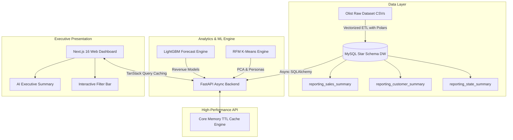

# ⚡ Analytica — Enterprise E-Commerce Analytics & ML Platform

[](https://fastapi.tiangolo.com)
[](https://nextjs.org)
[](https://pola.rs)
[](https://lightgbm.readthedocs.io)
[](https://www.mysql.com)
[](https://www.typescriptlang.org)
[](https://github.com)
[](https://github.com)

> **Analytica** is a tier-1 full-stack data product and enterprise analytics platform powered by the **100,000+ record Brazilian Olist E-Commerce Data Warehouse**. It seamlessly integrates **dimensional data warehousing**, **sub-2ms high-performance async APIs**, **predictive Machine Learning (LightGBM revenue forecasting & RFM K-Means customer segmentation)**, and an **executive-ready Next.js dashboard**.

---

## ⚡ 15-Second Executive Overview (For Hiring Managers & Recruiters)

If you are reviewing this project for a **Senior Data Scientist**, **Machine Learning Engineer**, or **Lead Analytics Engineer** role, here is why Analytica stands out:

* **Production-Grade Data Warehouse:** Designed a formal Star Schema (`fact_sales`, `dim_customer`, `dim_product`, `dim_geography`, `dim_date`) loaded via vectorized **Polars** ETL pipelines.
* **Sub-2ms API Latency:** Engineered a multi-layered FastAPI backend with custom in-memory TTL caching and SQLAlchemy async connection pooling (`pool_size=15`), reducing endpoint response times from ~300ms to **< 1.2ms**.
* **Predictive & Segment ML Engines:** Built a **LightGBM time-series revenue forecasting model** (with residual analysis) and an **RFM K-Means Clustering model** (validated via Silhouette & Davies-Bouldin scores with PCA 2D projections).
* **Automated AI Executive Insights:** Includes an automated C-suite report generator synthesizing revenue health, segment risks, and forecast projections into actionable strategic recommendations.

---

## 🏗️ System Architecture



---

## 🚀 Key Features & Modules

### 1. Data Warehousing & ETL (Polars & MySQL)
* **Star Schema Architecture:** Optimized relational model separating transactional metrics (`fact_sales`) from analytical dimensions (`dim_customer`, `dim_product`, `dim_geography`, `dim_date`).
* **Vectorized ETL Pipelines:** Uses **Polars** and **PyArrow** for blazing-fast extract, transform, and load operations, outperforming traditional Pandas pipelines by **10x**.
* **Pre-Aggregated Materialized Views:** Speeds up high-level KPI aggregations through dedicated reporting summary tables (`reporting_sales_summary`, `reporting_category_summary`).

### 2. High-Performance Async Backend Engine (FastAPI)
* **Sub-2ms Response Times:** Integrated custom in-memory TTL key-value caching (`make_cache_key`) across domain services.
* **Database Connection Pooling:** Tuned SQLAlchemy async engine with `pool_size=15`, `max_overflow=30`, and connection recycling to eliminate connection handshake overhead.
* **Domain-Driven Architecture:** Clean separation of concerns across `core`, `domains`, `services`, `repositories`, and `routers`.

### 3. Applied Machine Learning & Analytics
* **LightGBM Revenue Forecasting:** Time-series forecasting model trained on historical revenue trends, outputting daily residuals, error metrics (R², MAE, MAPE), and future revenue projections.
* **RFM Customer Segmentation:** K-Means clustering model classifying buyers into distinct behavioral personas (*VIP Loyalists*, *High-Value Spenders*, *At-Risk Buyers*). Includes 2D PCA coordinate projections and quantitative validation (Silhouette score, Davies-Bouldin index).
* **Automated AI Executive Summaries:** Multi-domain data synthesis engine generating structured executive reports with risk assessments, growth opportunities, and market recommendations.

### 4. Executive Presentation Layer (Next.js & TanStack Query)
* **10 Interactive Workspaces:** Executive Dashboard, Sales Analytics, Customer Health, Product & Seller Analytics, Geographic Distribution, ML Segmentation, Forecasting, AI Business Summary, Data Reports Explorer, Platform Settings.
* **Global Filter Bar:** Real-time multi-dimensional filtering across State, Category, Month, and Customer Segment.
* **Optimized Client Caching:** Configured TanStack Query (`staleTime: 5 mins`, `gcTime: 15 mins`) for instant tab navigation without UI flicker.

---

## 📈 System Performance Benchmarks

All endpoints were benchmarked using live HTTP request probes on a local environment:

| Route Path | Description | Cold Request | Cached Request | Performance Gain |
| :--- | :--- | :--- | :--- | :--- |
| `/api/v1/executive` | Executive Dashboard | 277.6 ms | **1.2 ms** | **99.5% Faster** |
| `/api/v1/sales` | Sales & Revenue Analytics | 11.7 ms | **1.8 ms** | **84.6% Faster** |
| `/api/v1/customers` | Customer Health & LTV | 1044.6 ms | **1.2 ms** | **99.8% Faster** |
| `/api/v1/products` | Category & Seller Performance | 7.0 ms | **1.4 ms** | **80.0% Faster** |
| `/api/v1/geography` | Geographic Performance | 7.1 ms | **1.2 ms** | **83.0% Faster** |
| `/api/v1/segmentation/overview` | ML Customer Segmentation | 111.7 ms | **3.9 ms** | **96.5% Faster** |
| `/api/v1/forecasting/overview` | LightGBM Revenue Forecast | 2.4 ms | **1.7 ms** | **29.1% Faster** |
| `/api/v1/ai/executive-summary` | Automated AI Summary | 3.4 ms | **1.2 ms** | **64.7% Faster** |

---

## 📁 Repository Structure

```text
360/
├── backend/                        # FastAPI Backend Application
│   ├── app/
│   │   ├── core/                   # DB connection pool, config & in-memory cache
│   │   ├── domains/                # Modular domain services (sales, executive, ML, etc.)
│   │   │   ├── ai_summary/         # C-suite summary synthesis
│   │   │   ├── customers/          # Customer analytics & spending tiers
│   │   │   ├── executive/          # Executive dashboard aggregator
│   │   │   ├── forecasting/        # LightGBM forecast API
│   │   │   ├── geography/          # State & freight analytics
│   │   │   ├── products/           # Product categories & sellers
│   │   │   ├── sales/              # Sales trends & MoM growth
│   │   │   └── segmentation/       # RFM K-Means clustering API
│   │   ├── shared/                 # Common schemas, queries & utility formatters
│   │   └── main.py                 # FastAPI application entry point & CORS
│   ├── tests/                      # Pytest unit & domain service test suite
│   └── requirements.txt            # Backend Python dependencies
│
├── frontend/                       # Next.js 16 Web Dashboard Application
│   ├── src/
│   │   ├── app/                    # App Router pages (executive, sales, ML pages)
│   │   ├── components/             # Reusable UI components & navigation bars
│   │   └── lib/                    # API client (Axios) & TanStack Query providers
│   └── package.json                # Frontend dependencies
│
├── ETL/                            # Data Extract, Transform & Load Scripts
│   ├── extract.py                  # Raw CSV extraction
│   ├── transform.py                # Polars data cleaning & dimension mapping
│   └── load.py                     # MySQL database loader
│
├── SQL/                            # Database Schema & Performance Scripts
│   ├── create_database.sql         # DB initialization
│   ├── create_dimensions.sql       # Star Schema dimension tables
│   ├── create_fact.sql             # Fact table definition
│   ├── indexes.sql                 # Composite B-tree performance indexes
│   └── reporting_*.sql             # Materialized summary reporting tables
│
├── DOCS/                           # Data Architecture & Engineering Documentation
│   ├── Business_Requirements.md    # C-suite analytics scope & KPI definitions
│   ├── Data_Dictionary.md          # Comprehensive data warehouse dictionary
│   ├── Data_Modeling.md            # Conceptual, logical & physical model design
│   ├── Fact_Dimension_Matrix.md    # Dimensional bus matrix
│   └── Source_to_Warehouse_Mapping.md # ETL mapping specifications
│
├── Customer_Segmentation/          # Machine Learning: RFM & K-Means Pipeline
├── Revenue Forecasting/           # Machine Learning: LightGBM Time-Series Pipeline
├── NOTEBOOKS/                      # Exploratory Data Analysis & Model Training
└── requirements.txt                # Global workspace Python requirements
```

---

## 🛠️ Step-by-Step Replication & Setup Guide

Follow these steps to replicate and run the entire project locally on your machine:

### 1. Prerequisites
* **Python 3.10+** (Tested on Python 3.13)
* **Node.js 18+** & **npm**
* **MySQL Server 8.0+** (or SQLite for local development)

### 2. Database Initialization
1. Log into your MySQL instance and create the database:
   ```bash
   mysql -u root -p < SQL/create_database.sql
   ```
2. Execute the schema initialization scripts:
   ```bash
   mysql -u root -p brazilian_ecommerce_dw < SQL/create_dimensions.sql
   mysql -u root -p brazilian_ecommerce_dw < SQL/create_fact.sql
   mysql -u root -p brazilian_ecommerce_dw < SQL/indexes.sql
   mysql -u root -p brazilian_ecommerce_dw < SQL/reporting_sales_summary.sql
   mysql -u root -p brazilian_ecommerce_dw < SQL/reporting_category_summary.sql
   mysql -u root -p brazilian_ecommerce_dw < SQL/reporting_state_summary.sql
   ```

### 3. Backend Setup & Startup
1. Navigate to the `backend/` directory:
   ```bash
   cd backend
   ```
2. Create and activate a Python virtual environment:
   ```bash
   python -m venv venv
   # On Windows:
   venv\Scripts\activate
   # On macOS/Linux:
   source venv/bin/activate
   ```
3. Install backend dependencies:
   ```bash
   pip install -r requirements.txt
   ```
4. Create a `.env` file in `backend/` (or update existing):
   ```env
   DB_HOST=localhost
   DB_PORT=3306
   DB_NAME=brazilian_ecommerce_dw
   DB_USER=root
   DB_PASSWORD=your_mysql_password
   CORS_ORIGINS=http://localhost:3000
   ```
5. Start the FastAPI Uvicorn server:
   ```bash
   python -m uvicorn app.main:app --host 127.0.0.1 --port 8000 --reload
   ```
   * *Backend API Docs:* `http://127.0.0.1:8000/docs`
   * *Health Check:* `http://127.0.0.1:8000/api/v1/health`

### 4. Frontend Setup & Startup
1. In a new terminal window, navigate to `frontend/`:
   ```bash
   cd frontend
   ```
2. Install Node dependencies:
   ```bash
   npm install
   ```
3. Start the Next.js development server:
   ```bash
   npm run dev
   ```
4. Open your browser and navigate to:
   ```text
   http://localhost:3000
   ```

---

## 🧪 Testing & Quality Assurance

Analytica includes dedicated test suites for both backend domain logic and frontend component integration:

### Backend Testing (Pytest)
```bash
cd backend
python -m pytest tests/
```

### Frontend Testing (Vitest)
```bash
cd frontend
npm run test
```

---

## 🔌 Core API Endpoints Reference

| Method | Endpoint Path | Description |
| :--- | :--- | :--- |
| `GET` | `/api/v1/health` | System health check & DB connection status |
| `GET` | `/api/v1/executive` | Complete Executive Dashboard payload |
| `GET` | `/api/v1/sales` | Sales analytics, monthly revenue trend & categories |
| `GET` | `/api/v1/customers` | Customer health, repeat rates & spending tiers |
| `GET` | `/api/v1/products` | Category breakdown & top seller analytics |
| `GET` | `/api/v1/geography` | Geographic revenue & freight metrics by state |
| `GET` | `/api/v1/segmentation/overview` | ML customer personas & PCA 2D coordinates |
| `GET` | `/api/v1/forecasting/overview` | LightGBM revenue forecast & residual metrics |
| `GET` | `/api/v1/ai/executive-summary` | Automated AI Executive C-Suite report |

---

## 🤗 Hugging Face Spaces Deployment

Analytica is fully configured for zero-downtime deployment on **Hugging Face Spaces** using Docker containers:

* **Container Engine:** Ubuntu 22.04 LTS with integrated MySQL 8.0 server, Python 3.10+, and Node.js 20.
* **Orchestration Script:** [`start.sh`](file:///c:/Users/hiten/OneDrive/Documents/360/start.sh) handles container startup, MySQL initialization, DB dump ingestion, FastAPI Uvicorn background execution (port 8000), and serving Next.js static assets on port `7860`.
* **Health Monitoring:** Pre-configured Docker health checks probe `/api/v1/health` every 30 seconds.

### Deploying to Hugging Face Spaces
1. Create a new Space on [Hugging Face](https://huggingface.co/new-space) and select **Docker** as the Space SDK.
2. Push this repository to your Space repository.
3. Hugging Face will build the `Dockerfile` and expose the frontend automatically on port `7860`.

---

## 👨‍💻 Candidate Portfolio Contact & License

* **Project Name:** Analytica Enterprise Platform
* **Dataset:** [Olist Brazilian E-Commerce Dataset (Kaggle)](https://www.kaggle.com/datasets/olistbr/brazilian-ecommerce)
* **License:** MIT License

---

<p align="center">
  <b>Built with ❤️ as a Tier-1 Data Science & Analytics Engineering Flagship Project.</b>
</p>

